# Voltz - Professional Service Platform

## Current Implementation

### Core Features

#### Authentication System
- User registration and login with email/password
- User type differentiation (Homeowner/Professional)
- Basic session management
- Profile data storage

#### Job Management
- Basic job creation and listing
- Job status tracking (active, scheduled, completed)
- Basic job details (title, description, price, date)
- Job assignment to professionals

#### Payment System
- Basic payment model structure
- Payment status tracking
- Multiple payment method support
- Basic transaction recording

#### Review System
- Basic review creation
- Star rating system
- Text comments
- Professional replies
- Photo attachment support

#### Notification System
- Basic notification types (job requests, status updates)
- Read/unread status
- Related entity linking
- Timestamp tracking

### Data Flow

1. **User Authentication Flow**
   - User registers/logs in
   - Profile data is loaded
   - User type determines available features

2. **Job Creation Flow**
   - Homeowner creates job request
   - Professionals receive notifications
   - Job status updates trigger notifications
   - Payment processing on completion

3. **Review Flow**
   - Job completion triggers review option
   - Review submission updates professional rating
   - Professional can respond to reviews

## Missing Implementations and Interactions

### 1. Enhanced Authentication
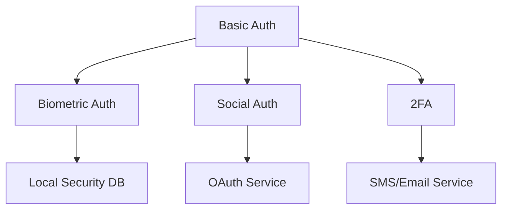
- **Implementation Needs**:
  - Biometric data storage and verification
  - OAuth provider integration
  - 2FA token management
  - Session token refresh mechanism

### 2. Advanced Job Management
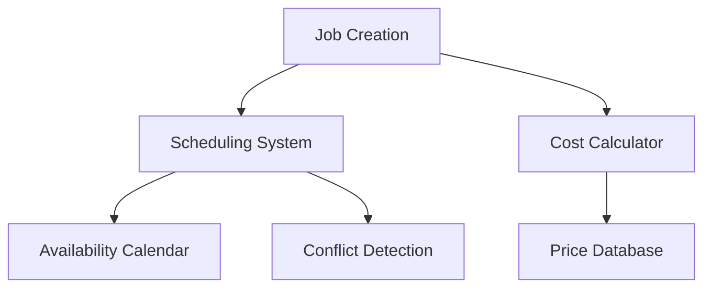
- **Implementation Needs**:
  - Scheduling database with time slots
  - Service area mapping system
  - Dynamic pricing rules
  - Job type categorization
  - Emergency request handling system

### 3. Comprehensive Payment System
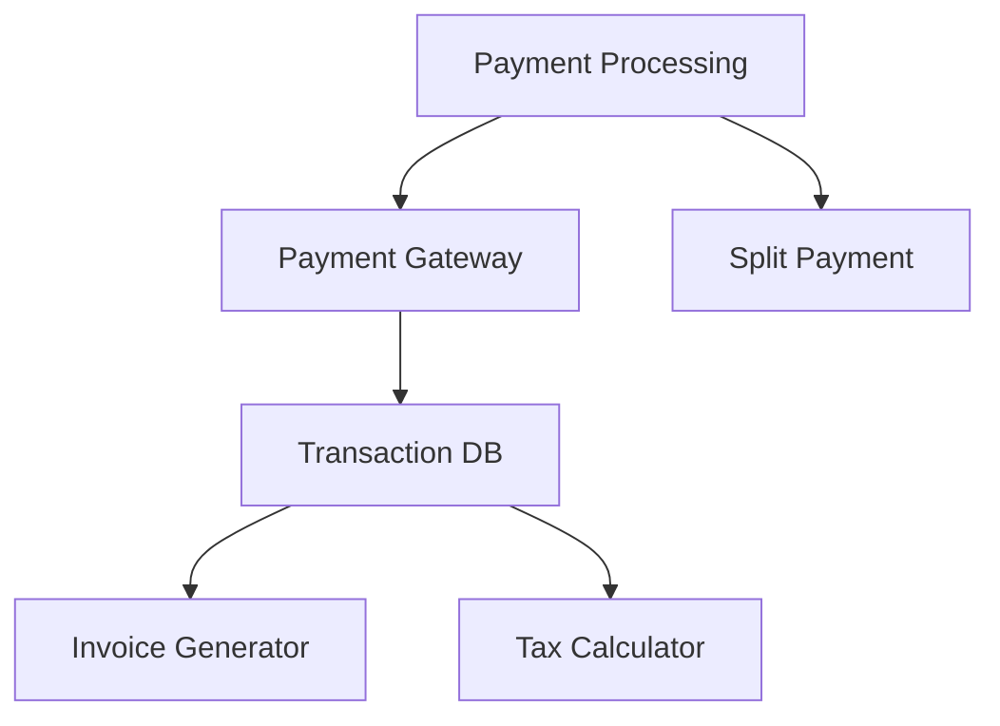
- **Implementation Needs**:
  - Payment gateway integration (Stripe/PayPal)
  - Invoice generation service
  - Tax calculation rules
  - Multi-currency support
  - Refund processing system

### 4. Enhanced Review System
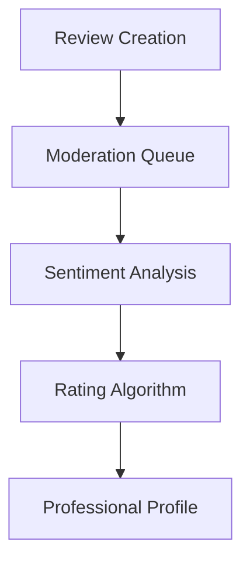
- **Implementation Needs**:
  - Review verification system
  - Content moderation service
  - Sentiment analysis integration
  - Review analytics database
  - Response time tracking

### 5. Advanced Notification System
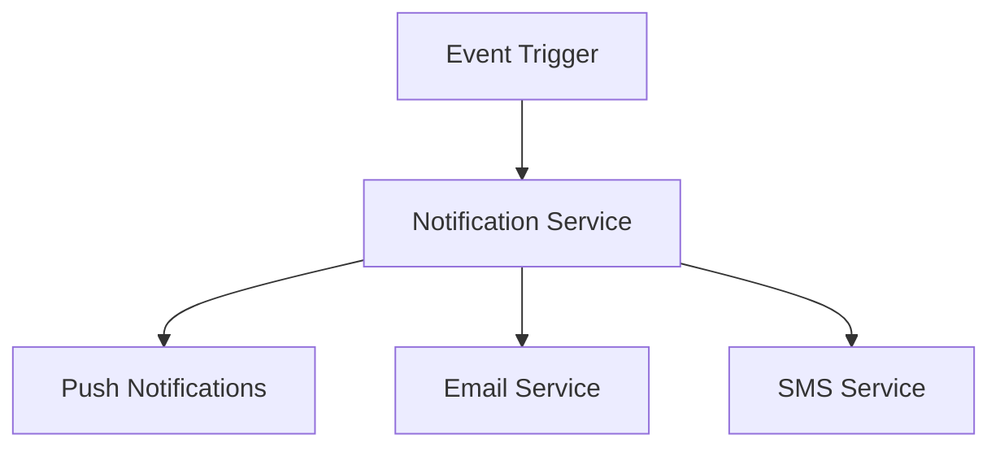
- **Implementation Needs**:
  - Push notification service
  - Notification preferences database
  - Message queue system
  - Rich media support
  - Offline queue management

### 6. Professional Management System
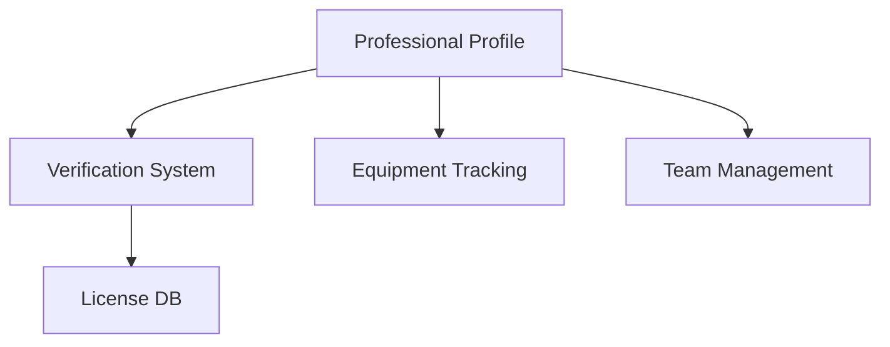
- **Implementation Needs**:
  - License verification system
  - Background check integration
  - Equipment inventory database
  - Team/crew management system
  - Service area definition

### Database Schema Considerations

1. **User Management Tables**
   - Users (base table)
   - UserProfiles (type-specific data)
   - Credentials (auth methods)
   - Sessions (active sessions)

2. **Job Management Tables**
   - Jobs (base info)
   - JobTypes (categories)
   - JobSchedules (time slots)
   - ServiceAreas (locations)

3. **Payment Tables**
   - Transactions
   - PaymentMethods
   - Invoices
   - TaxRates
   - Refunds

4. **Review Tables**
   - Reviews
   - ReviewResponses
   - ReviewMedia
   - ReviewMetrics

5. **Notification Tables**
   - Notifications
   - NotificationPreferences
   - NotificationQueue
   - DeviceTokens

6. **Professional-Specific Tables**
   - Licenses
   - Certifications
   - Equipment
   - Teams
   - Availability

### Integration Points

1. **External Services**
   - Payment gateways
   - Push notification services
   - SMS/Email providers
   - Map/location services
   - Document verification services

2. **Internal Services**
   - Authentication service
   - Job matching algorithm
   - Pricing calculator
   - Rating system
   - Notification dispatcher

3. **Real-time Features**
   - Chat system
   - Location tracking
   - Status updates
   - Availability updates
   - Emergency alerts

### Security Considerations

1. **Data Protection**
   - Personal information encryption
   - Payment data security
   - Document storage security
   - Session management

2. **Access Control**
   - Role-based permissions
   - API authentication
   - Rate limiting
   - Request validation

3. **Compliance**
   - Data privacy regulations
   - Payment processing standards
   - Professional licensing requirements
   - Insurance verification

### Detailed Class Relationships

#### Core Domain Models
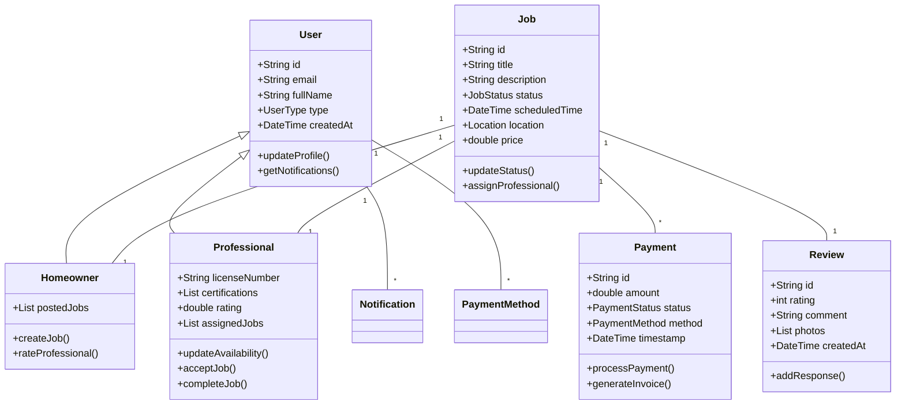

#### Service Layer Interactions
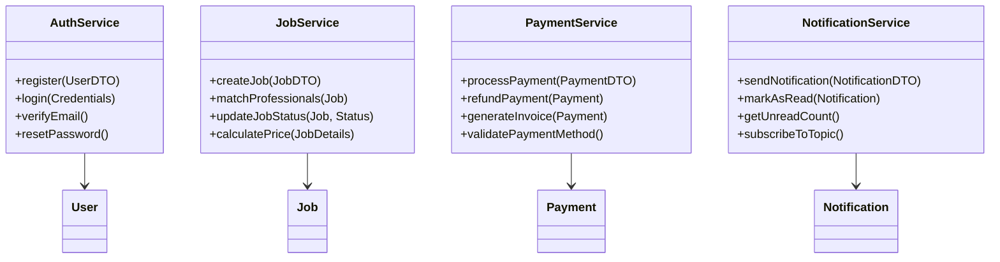

### Key Interactions and Workflows

#### 1. Job Creation and Assignment Flow
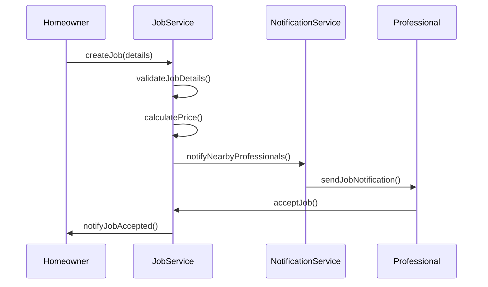

#### 2. Payment Processing Flow
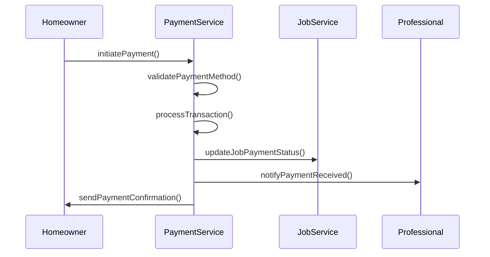

### Implementation Guidelines

#### 1. State Management
- Use Provider pattern for global state
- Implement repository pattern for data access
- Cache frequently accessed data
- Implement optimistic updates for better UX

#### 2. Error Handling
```dart
class AppError extends Error {
    final String message;
    final ErrorType type;
    final dynamic originalError;
    
    AppError(this.message, this.type, [this.originalError]);
}

enum ErrorType {
    network,
    authentication,
    validation,
    server,
    unknown
}
```

#### 3. API Integration
- Use REST for standard CRUD operations
- Implement WebSocket for real-time features
- Handle token refresh automatically
- Implement retry logic for failed requests

#### 4. Data Persistence
- Use Supabase for backend storage
- Implement local caching with Hive
- Handle offline data synchronization
- Implement data migration strategies

#### 5. Testing Strategy
- Unit tests for business logic
- Widget tests for UI components
- Integration tests for critical flows
- E2E tests for main user journeys

## Version 2.0 - Future Features & Improvements

### 1. AI-Powered Job Matching
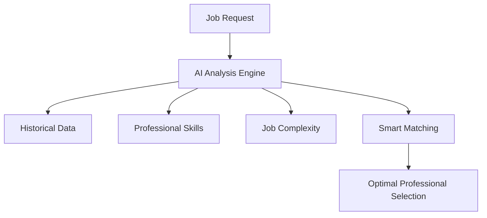
- Machine learning for job-professional matching
- Predictive pricing based on job complexity
- Automated skill assessment
- Job difficulty estimation
- Success rate prediction

### 2. Advanced Scheduling System
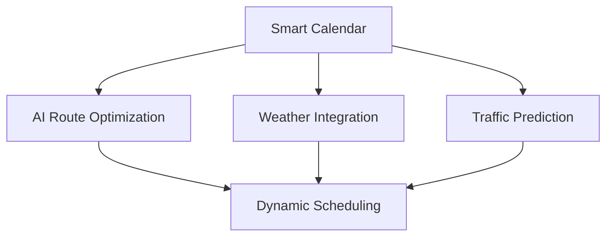
- Smart route optimization
- Weather-aware scheduling
- Traffic-based timing adjustments
- Multi-job optimization
- Emergency job integration

### 3. Enhanced Customer Experience
- **Virtual Job Assessment**
  - AR-powered remote inspection
  - Video consultation feature
  - Real-time cost estimation
  - Visual problem documentation
  - Interactive troubleshooting guides

- **Smart Home Integration**
  - IoT device compatibility
  - Smart meter integration
  - Automated diagnostics
  - Energy usage analysis
  - Preventive maintenance alerts

### 4. Business Intelligence
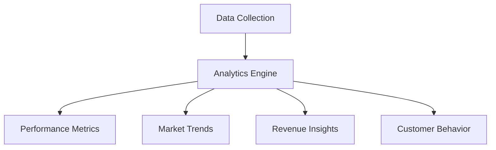
- Advanced analytics dashboard
- Performance trend analysis
- Revenue forecasting
- Customer behavior insights
- Market demand prediction

### 5. Enhanced Security Features
- **Blockchain Integration**
  - Smart contracts for jobs
  - Secure payment processing
  - Immutable job history
  - Digital credentials verification
  - Automated compliance checks

- **Advanced Authentication**
  - Biometric authentication
  - Hardware security keys
  - Zero-knowledge proof verification
  - Fraud detection system
  - Real-time threat monitoring

### 6. Community Features
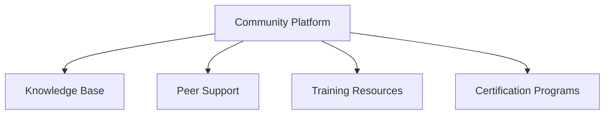
- Professional community forum
- Knowledge sharing platform
- Training resources
- Certification programs
- Mentorship system

### 7. Sustainability Features
- **Green Energy Integration**
  - Solar installation expertise
  - EV charger specialization
  - Energy efficiency audits
  - Green certification tracking
  - Carbon footprint monitoring

### 8. Financial Tools
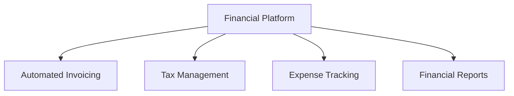
- Automated bookkeeping
- Tax preparation assistance
- Financial forecasting
- Expense management
- Investment planning tools

### 9. Quality Assurance System
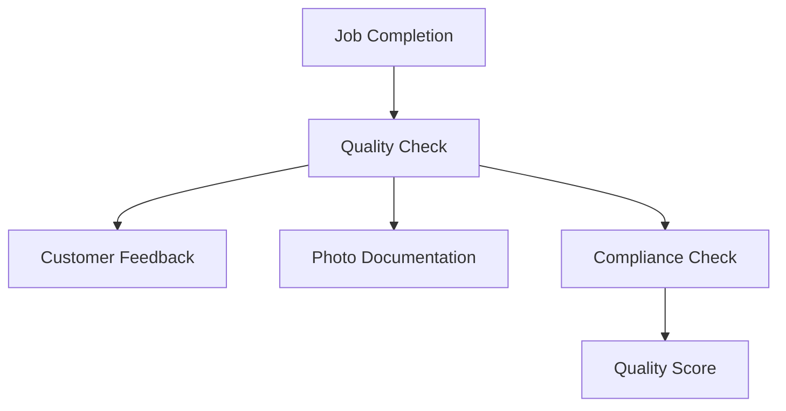
- Automated quality checks
- Standard compliance verification
- Photo documentation system
- Customer satisfaction tracking
- Quality score analytics

### 10. Mobile Enhancements
- **Offline Capabilities**
  - Full offline functionality
  - Background sync
  - Conflict resolution
  - Local data encryption
  - Bandwidth optimization

- **Field Service Tools**
  - Digital measurement tools
  - Parts inventory scanner
  - Voice-commanded reporting
  - Augmented reality guides
  - Real-time collaboration tools

### Implementation Timeline
```mermaid
gantt
    title Version 2.0 Implementation Plan
    dateFormat  YYYY-Q1
    
    section Core Features
    AI Matching System       :2024-Q1, 90d
    Advanced Scheduling     :2024-Q2, 90d
    
    section Experience
    Virtual Assessment      :2024-Q2, 90d
    Smart Home Integration  :2024-Q3, 90d
    
    section Platform
    Business Intelligence   :2024-Q3, 90d
    Community Features      :2024-Q4, 90d
    
    section Security
    Blockchain Integration  :2024-Q4, 90d
    Enhanced Security       :2025-Q1, 90d
```

### Technical Requirements for V2.0
1. **Infrastructure Upgrades**
   - Kubernetes cluster deployment
   - Microservices architecture
   - Event-driven system design
   - Edge computing integration
   - AI/ML pipeline setup

2. **Data Architecture**
   - Real-time analytics pipeline
   - Data lake implementation
   - ML model training infrastructure
   - Time-series databases
   - Graph database for relationships

3. **Security Enhancements**
   - Zero-trust architecture
   - End-to-end encryption
   - Quantum-safe cryptography
   - Advanced threat protection
   - Automated security testing

## Supabase Database Implementation

### Database Schema Overview
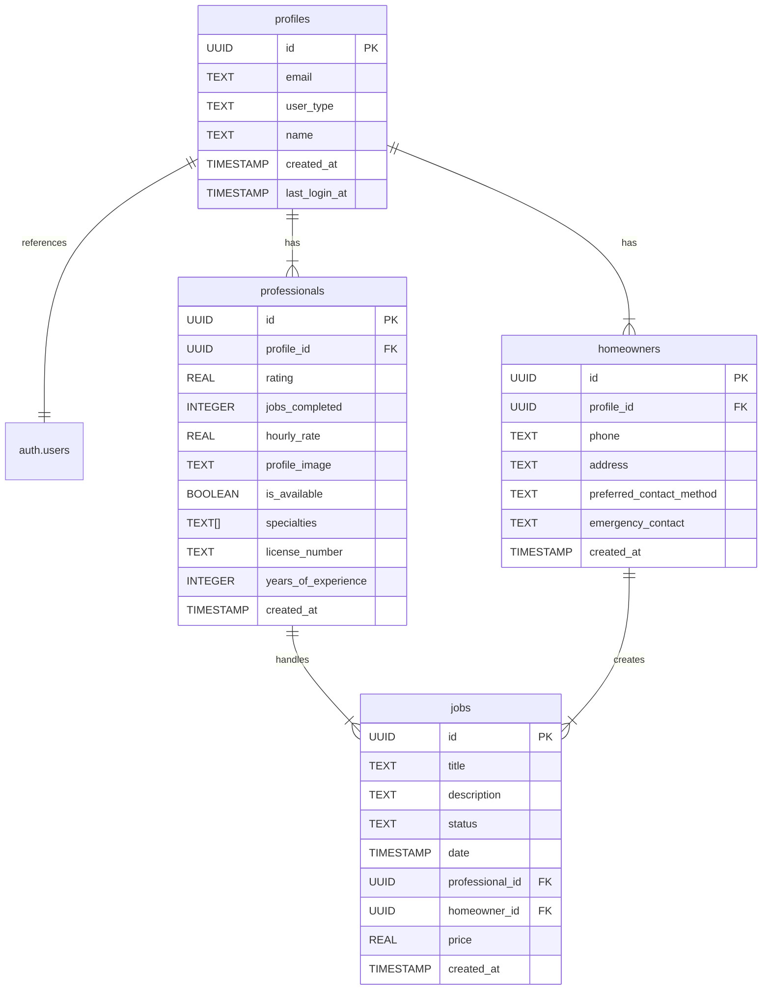

### Database Triggers and Functions

#### 1. New User Handler
```sql
-- Trigger: on_auth_user_created
-- Fires: AFTER INSERT ON auth.users
-- Function: handle_new_user()
```
**Purpose**: Automatically creates appropriate profile records when a new user registers
- Creates entry in profiles table
- Creates corresponding record in either homeowners or professionals table
- Handles user type determination based on registration metadata

### Row Level Security (RLS) Policies

#### 1. Profiles Table
```sql
- "Enable read access for own profile"
  - Can only read own profile data
- "Enable update for own profile"
  - Can only update own profile data
```

#### 2. Professionals Table
```sql
- "Enable read access for all users"
  - Public read access
- "Enable insert for professional profiles"
  - Only for users with professional type
- "Enable update for own profile"
  - Only professional can update their own data
```

#### 3. Homeowners Table
```sql
- "Enable read access for all users"
  - Public read access
- "Enable insert for homeowner profiles"
  - Only for users with homeowner type
- "Enable update for own profile"
  - Only homeowner can update their own data
```

#### 4. Jobs Table
```sql
- "Enable read access for involved parties"
  - Only homeowner and assigned professional can read
- "Enable insert for homeowners"
  - Only homeowners can create jobs
- "Enable update for involved parties"
  - Both homeowner and assigned professional can update
```

### Table Relationships

1. **User Authentication Flow**
   ```mermaid
   graph TD
       A[auth.users] -->|triggers| B[handle_new_user]
       B -->|creates| C[profiles]
       C -->|creates| D[homeowners/professionals]
   ```

2. **Job Management Flow**
   ```mermaid
   graph TD
       A[homeowners] -->|creates| B[jobs]
       C[professionals] -->|assigned to| B
       B -->|updates| D[job status]
   ```

### Data Types and Constraints

1. **Primary Keys**
   - All tables use UUID type
   - Generated using `gen_random_uuid()`

2. **Foreign Keys**
   - `profiles.id` references `auth.users(id)`
   - `professionals.profile_id` references `profiles(id)`
   - `homeowners.profile_id` references `profiles(id)`
   - `jobs.professional_id` references `professionals(id)`
   - `jobs.homeowner_id` references `homeowners(id)`

3. **Default Values**
   - `created_at`: `CURRENT_TIMESTAMP`
   - `rating`: 0.0
   - `jobs_completed`: 0
   - `is_available`: true
   - `user_type`: 'homeowner'

### Security Implementation

1. **Row Level Security**
   - Enabled on all tables
   - Custom policies for each table
   - Role-based access control

2. **Data Validation**
   - Type checking
   - Foreign key constraints
   - Not null constraints where appropriate

### Future Database Enhancements (V2)

1. **Additional Tables Planned**
   ```sql
   - payments
   - reviews
   - chat_messages
   - notifications
   - service_areas
   - equipment_inventory
   - certifications
   ```

2. **Enhanced Triggers**
   ```sql
   - job_status_update_trigger
   - payment_processing_trigger
   - rating_update_trigger
   - notification_trigger
   ```

3. **Materialized Views**
   ```sql
   - professional_performance_metrics
   - job_statistics
   - earnings_reports
   - customer_activity
   ```

4. **Indexing Strategy**
   ```sql
   - GiST indexes for location-based queries
   - B-tree indexes for timestamp columns
   - Hash indexes for UUID lookups
   - Partial indexes for common filters
   ```
