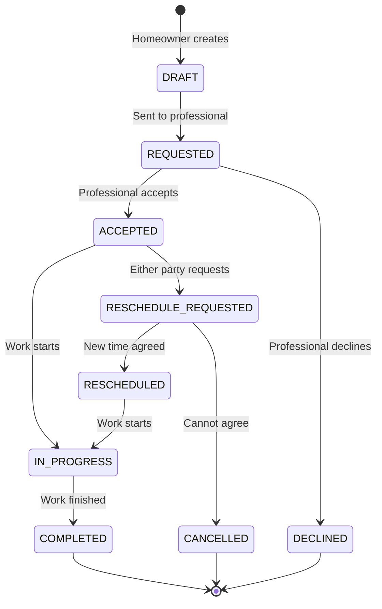

# Job Scheduling and Management Flow Design

## Overview
This document outlines the proposed solution for handling complex job scheduling scenarios between homeowners and professionals, focusing on user experience and system flexibility.

## Core Concepts

### 1. Job Creation Types
1. **Public Job Posting** (Current Implementation)
   - Homeowner creates a job visible to all professionals
   - Any professional can accept/decline
   - Simple but lacks personalization

2. **Direct Request** (New Feature)
   - Homeowner selects a specific professional
   - Based on previous experience or recommendations
   - More personalized approach
   - Requires professional profile browsing feature

3. **Schedule-Based Booking** (New Feature)
   - Professional publishes available time slots
   - Homeowners can book specific slots
   - More structured approach
   - Requires calendar management

### 2. Job States



#### State Definitions:
- **DRAFT**: Initial job creation by homeowner
- **REQUESTED**: Sent to specific professional
- **ACCEPTED**: Professional has agreed to job
- **DECLINED**: Professional cannot take job
- **RESCHEDULE_REQUESTED**: Change in schedule needed
- **RESCHEDULED**: New schedule agreed upon
- **IN_PROGRESS**: Work has started
- **COMPLETED**: Work finished
- **CANCELLED**: Job terminated before completion

### 3. User Experience Flows

#### A. Homeowner Flow

1. **Creating a Job**
   - Choose between public posting or direct request
   - If direct request:
     - Browse professional profiles
     - View ratings and availability
     - Select preferred professional
   - If schedule-based:
     - View professional's calendar
     - Select available time slot
   - Fill job details
     - Description
     - Photos
     - Preferred dates/times
     - Budget range

2. **Managing a Job**
   - View job status
   - Communicate with professional
   - Respond to reschedule requests
   - Cancel if needed
   - Rate after completion

#### B. Professional Flow

1. **Profile Management**
   - Set working hours
   - Mark available time slots
   - Set service areas
   - Update skills/certifications

2. **Job Management**
   - View incoming requests
   - Accept/decline jobs
   - Request schedule changes
   - Update job status
   - Communicate with homeowner

### 4. Communication Features

1. **In-App Messaging**
   - Real-time chat
   - Photo sharing
   - Quote discussions
   - Schedule coordination

2. **Notifications**
   - Job status changes
   - New messages
   - Schedule change requests
   - Upcoming job reminders

### 5. Schedule Management

1. **Professional Calendar**
   - Block out availability
   - Set recurring schedules
   - Mark emergency slots
   - Buffer time between jobs

2. **Conflict Resolution**
   - Automated suggestions for reschedule
   - Priority handling
   - Emergency override options

## Implementation Priorities

### Phase 1: Direct Request System
1. Implement professional profiles
2. Add direct job request flow
3. Basic messaging system

### Phase 2: Schedule Management
1. Calendar integration
2. Availability management
3. Booking system

### Phase 3: Advanced Features
1. Real-time chat
2. Enhanced notifications
3. Conflict resolution system

## Technical Considerations

### Database Schema Updates
```sql
-- New tables needed:

-- Professional availability
CREATE TABLE professional_availability (
    id UUID PRIMARY KEY,
    professional_id UUID,
    date DATE,
    start_time TIME,
    end_time TIME,
    status VARCHAR(20), -- AVAILABLE, BOOKED, BLOCKED
    created_at TIMESTAMP,
    updated_at TIMESTAMP
);

-- Schedule changes
CREATE TABLE schedule_changes (
    id UUID PRIMARY KEY,
    job_id UUID,
    requested_by UUID,
    original_date DATE,
    original_time TIME,
    proposed_date DATE,
    proposed_time TIME,
    status VARCHAR(20), -- PENDING, ACCEPTED, REJECTED
    created_at TIMESTAMP,
    updated_at TIMESTAMP
);

-- Direct requests
CREATE TABLE direct_requests (
    id UUID PRIMARY KEY,
    job_id UUID,
    homeowner_id UUID,
    professional_id UUID,
    status VARCHAR(20),
    message TEXT,
    created_at TIMESTAMP,
    updated_at TIMESTAMP
);
```

### API Endpoints

1. **Schedule Management**
```
GET /api/professional/{id}/availability
POST /api/professional/{id}/availability
PUT /api/professional/{id}/availability/{id}
DELETE /api/professional/{id}/availability/{id}
```

2. **Direct Requests**
```
POST /api/jobs/{id}/request/{professional_id}
GET /api/professional/{id}/requests
PUT /api/requests/{id}/respond
```

3. **Schedule Changes**
```
POST /api/jobs/{id}/reschedule
GET /api/jobs/{id}/schedule-changes
PUT /api/schedule-changes/{id}/respond
```

## User Interface Updates

### New Screens Needed:

1. **Professional Profile**
   - Public view for homeowners
   - Edit view for professionals
   - Calendar view
   - Reviews and ratings

2. **Schedule Management**
   - Calendar interface
   - Availability settings
   - Booking management

3. **Request Management**
   - Direct request inbox
   - Schedule change requests
   - Conflict resolution interface

## Success Metrics

1. **User Satisfaction**
   - Reduced cancellation rates
   - Higher completion rates
   - Better ratings

2. **System Efficiency**
   - Faster booking process
   - Fewer schedule conflicts
   - Increased direct bookings

3. **Business Impact**
   - More repeat customers
   - Higher professional retention
   - Increased platform usage

## Next Steps

1. Review and prioritize features
2. Create detailed UI/UX designs
3. Plan phased implementation
4. Develop MVP for testing
5. Gather user feedback
6. Iterate and improve

## Risks and Mitigations

1. **Complexity**
   - Start with core features
   - Gradual rollout
   - Clear user documentation

2. **User Adoption**
   - Intuitive interface
   - User onboarding
   - Feature education

3. **Technical Challenges**
   - Robust testing
   - Scalable architecture
   - Performance monitoring 